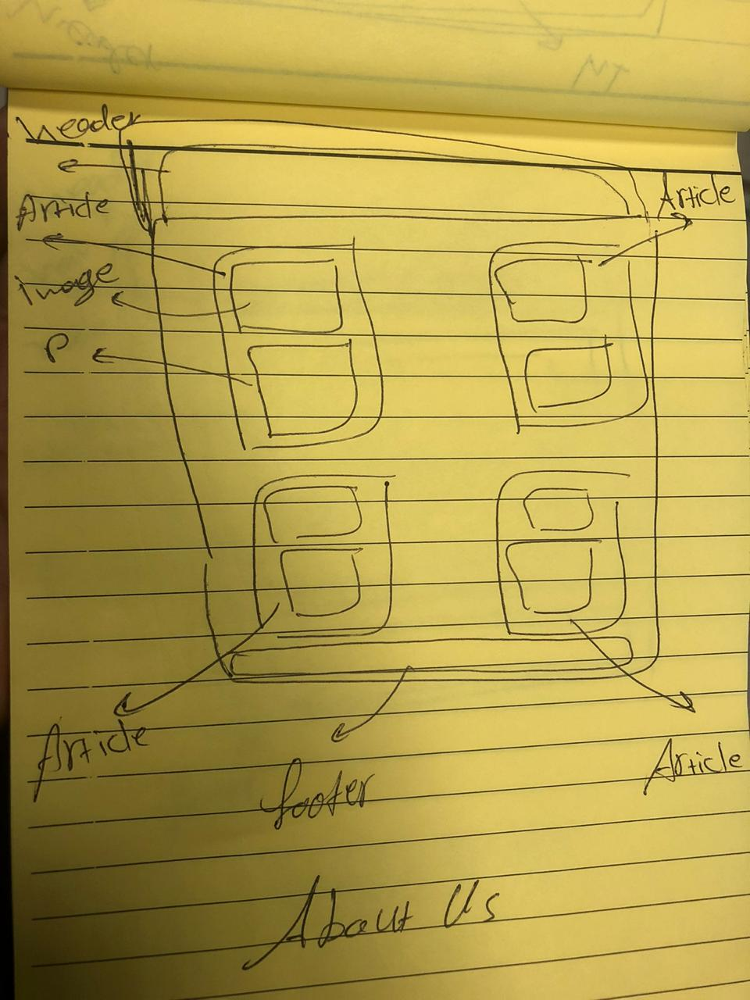

# Gussing-Game

### This repo about our project at class 201d1 in Amman

## MINT Organaization Member:
1. ### ***Muna*** 
1. ### ***Naseem***
1. ### ***Tasneem***
1. ### ***Ibarhim***

### User Stories
- As a developer I want to create a simple game that depends on user choice so that everyone can play this game if he/she wants to got some entertanment or a lot of relaxing time.

- This game about choosing a picture that belongs to catogary, the webpage will include several diffrent picturs from diffrent catogries, it will ask you to select the pic based on the catogary that shows on the screen, this operation will repeat itself couple of times, each time you choose the correct pic you will get a point.

### MVP 
- The goal of this website is to have at least:
1. Two pics from two different catagories. 
1. A counter of your total points. 
1. And the repeatation will be like 5 times.

### Project Domain:

### Wireframes:

